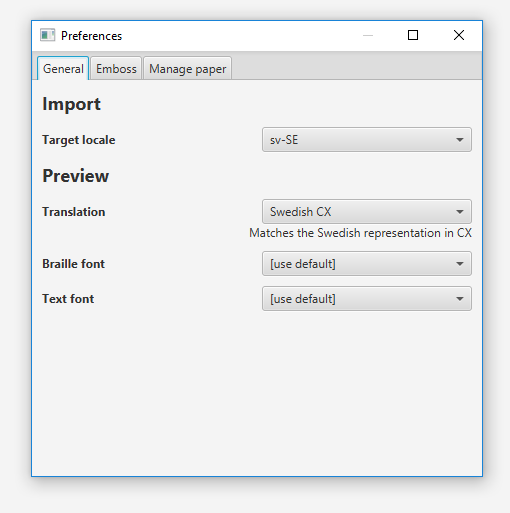
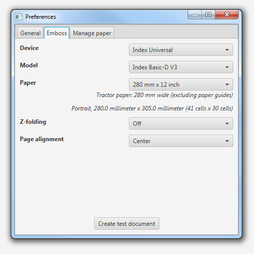

[[Table of Contents|Toc]]

# Dotify Studio User Guide #
Dotify Studio provides an accessible graphical user interface for creating, managing and embossing PEF-files.

## Preferences ##
Before you can convert to or emboss a PEF-file, you must complete the setup. The menu item `Preferences` opens a dialog with tabs.

### General ###
The `General` tab contains a couple of basic settings, such as the target locale used when converting source documents into PEF and the preview font used when viewing a PEF-file.

_Screenshot of general setup view._ 

### Emboss ###
The `Emboss` tab contains settings related to embossing. 
 1. First select your **Device**. 
 1. Next you need to select the **Embosser** make and model. Given the device name above, it might seem apparent what the choice should be, but the application cannot interpret this information. It is very important that you select the correct embosser make and model, otherwise the application will not be able to emboss your documents correctly.

Additional options will be presented when embosser has been selected. Once all required options has been set, you will be able to emboss documents.

_Screenshot of embosser setup view._

#### Embosser limitations ####
All embosser implementations have limitations. In other words, none of the implementations support
all features of the PEF 1.0 specification. Some support physical volumes and some support
8-dot to some extent. None support accurate row spacing. Note that this may be caused by limitations
in the hardware, in the embosser's protocol or in the "driver" implementation.

Under the **Model** drop-down, support for these key features are presented when a model is selected.   

### Manage paper ###
The `Manage paper` tab is used to define and manage custom paper formats.

## Open a file ##
To open a file, select the **Open...** menu option in the **File** menu. Dotify Studio supports 
opening PEF-files and HTML-files for editing with preview and OBFL, XML and TXT for editing without preview.

### Library ###
If you keep your PEF-files below a common folder, they can be found using the metadata supplied with the PEF-files.
For example by entering the title of a document.

To do this, open the `Library` tab in the tools area by selecting the **Library** menu option in the **Window** menu. By default
the "user home folder" is scanned, but it can be changed by clicking the `Select folder` button.

## Import source documents ##

A source document is a document that isn't braille yet, but can be. To import source documents, use the menu item `Import/Source document...`. 

When importing, a connection with the source document is maintained until the result is saved as a PEF-file. 
This means that the import can be re-run if the source is changed or if an option is modified. If the source is modified, the import
is automatically triggered and the result is updated as soon as the import is completed. Note that if the embedded editor is used, the source
document must be saved in order to trigger the automatic import. If an option is modified, the import can be manually updated by clicking `Apply`.

The import panel options are dynamic, which means that available options may depend on the value of other options. In
some cases, additional options can be activated by changing the value of an "activator" parameter. In this case, the import
must be re-run before the additional options show up.

### Import braille text files ###
A braille text file is a text file containing line breaks and form feeds to indicate where lines and pages end. In addition,
a small set of characters is used, essentially corresponding one-to-one with a braille cell. To import braille text
files, use the menu item `Import/Braille text files...`.

If you have a text file that is plain text, but _not_ braille, the above option should be used instead.

## Converter
The converter is activated when source documents are imported. It provides the necessary transformation from the input to the target format (typically PEF). Each source/target combination can have different options. The available options may also depend on the current value of another option.

### Templates
Templates can be used to save and load converter options.

When saving a template, the currently set options are stored with the specified name and description. The value for options that have not been set are not stored. Therefore, a change in a default value may cause the template to behave differently than it did before.

When loading a template, set options are restored to their defaults before applying the template.

### Merge PEF-files ###
A set of single volume PEF-files can be merged into a multi-volume PEF-file using the menu item `File/Import/Merge PEF-files`. All files selected in the import dialog will be included in the merged file. The identifier and file merge order can be configured in the dialog that appears after the files have been chosen.

## Exporting ##
The available export commands depend on the file type in the selected editor. Currently, only PEF-files has export commands, but export commands for other file formats may be added in the future.

### PEF: Export to text ###
Exporting a PEF-file as text can be done by using the menu item `File/Export/Export to text...`. This will export the file as text. By default, the same translation is used as when previewing a PEF-file, but this can be changed in the dialog that appears after the target file has been selected.

### PEF: Split PEF ###

A PEF-file can be split into several files using the menu item `File/Export/Split PEF`. Select a folder where the resulting files should be stored. It is recommended that an empty folder is selected. Note that a folder might _appear_ empty when it's not because the dialog only displays folders.

## Embossing ##
The menu item `Emboss` opens an emboss dialog. Review the document information to verify that you are embossing the correct document.

To emboss a range of pages, a single volume or multiple copies, set the corresponding option.

To emboss, click **Emboss**.

_Screenshot of Emboss view._

To see more information about the book, select **About the book** in the preview window.
